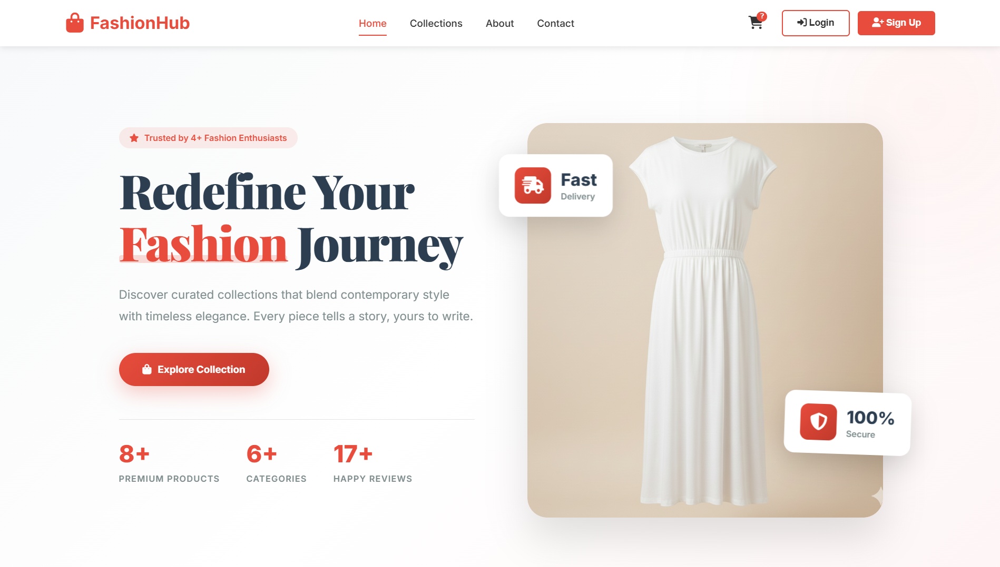
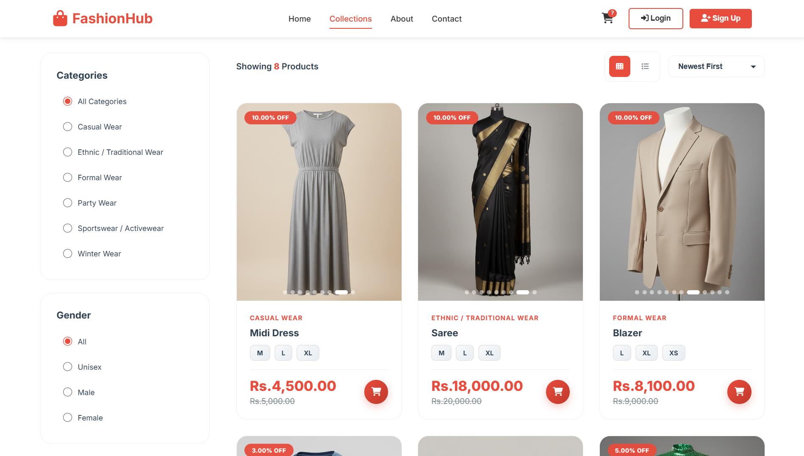
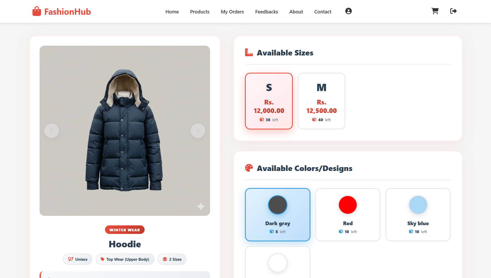
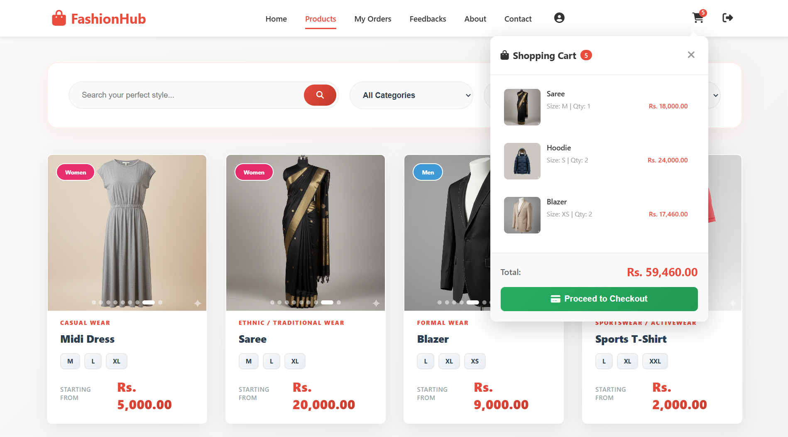
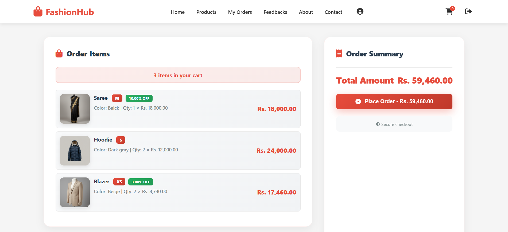
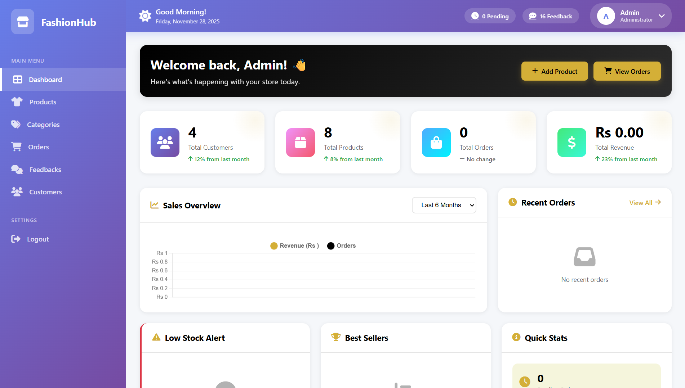
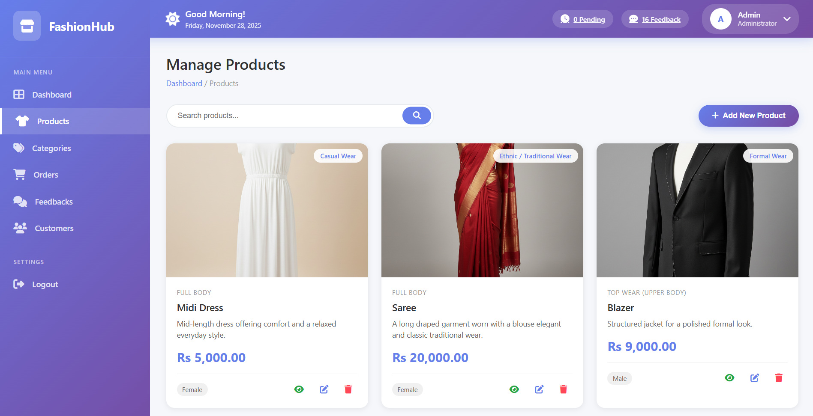
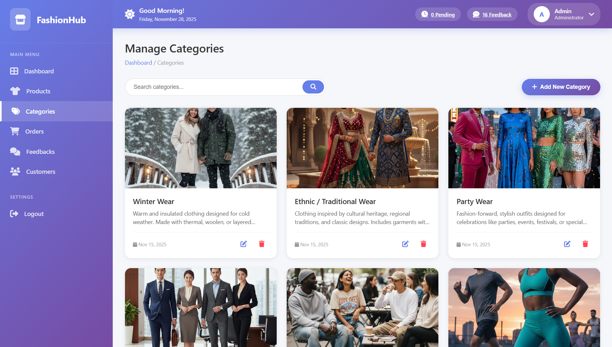
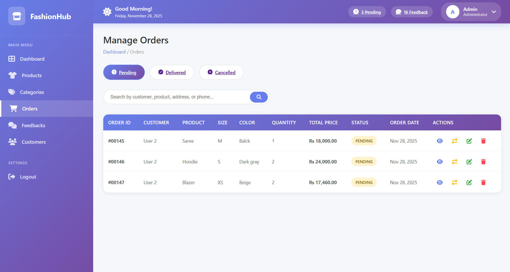
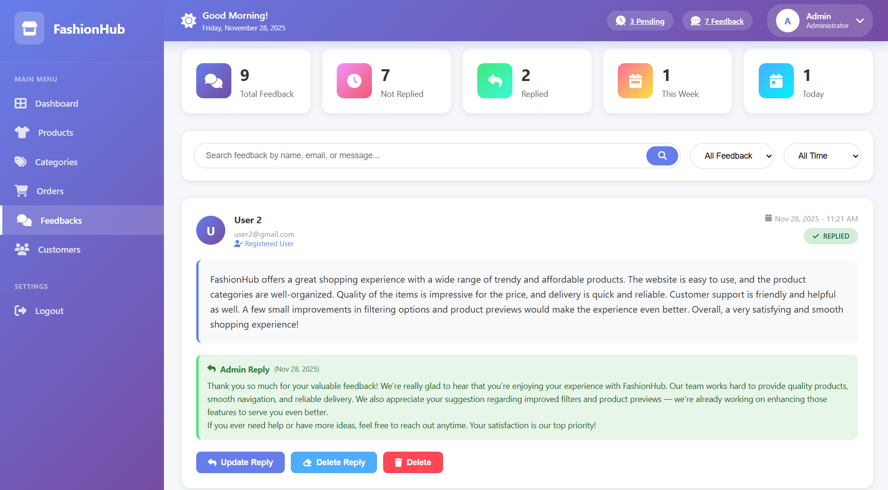

# 🛍️ FashionHub - E-Commerce Fashion Store

A modern e-commerce platform for fashion products built with PHP and MySQL.


---

## ✨ Features

### Customer Features
- Browse products by categories (Casual, Formal, Ethnic, Sportswear)
- Product filtering by size, color, and price
- Shopping cart with real-time updates
- Order tracking and history
- User feedback system

### Admin Features
- Dashboard with sales analytics and charts
- Product management (Add, Edit, Delete)
- Order management with status updates
- Customer management
- Low stock alerts and best sellers tracking
- Feedback management

---

## 📸 Screenshots

### Customer Interface

**Homepage**


**Products Page**


**Product Details**


**Shopping Cart**


**Checkout**


### Admin Panel

**Admin Dashboard**


**Manage Products**


**Manage Categories**


**Manage Orders**


**Manage Feedbacks**


**Manage Users**


---

## 🛠️ Tech Stack

- **Frontend**: HTML5, CSS3, JavaScript, Chart.js, Font Awesome
- **Backend**: PHP 7.4+
- **Database**: MySQL 8.0+

---

## 📁 Project Structure

```
fashionhub/
├── Admin/                 
│   ├── Components/     
│   ├── AdminDashboard.php
│   ├── ManageCategory.php
│   ├── ManageFeedbacks.php
│   ├── ManageOrders.php
│   ├── ManageProducts.php
│   └── ManageCustomers.php
│   ├── update_admin_profile.php
│   ├── ViewOrderDetails.php
├── Components/             # Shared components (navbar, footer)
├── Customer/               
│   ├── Components/
│   ├── AboutUs.php
│   ├── CartItemCheckout.php
│   ├── ContactUs.php
│   ├── CustomerDashboard.php
│   ├── CustomerOrders.php
│   ├── Feedback.php
│   ├── OrderNow.php
│   ├── Products.php
│   ├── Profile.php
├── AboutUs.php
├── Collections.php
├── ContactUs.php
├── Homepage.php
├── ProductDetails.php
├── db_connect.php          # Database connection
├── index.php
└── logout.php
```

---

⭐ **Star this repo if you like it!**
